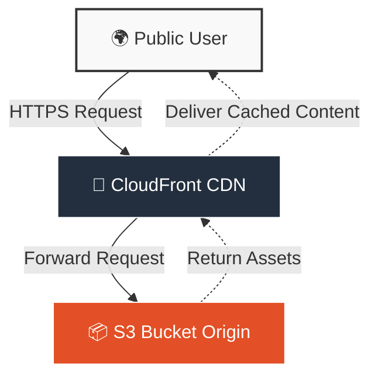

  

 

  
  
  
  

 
 

### ☁️ Architecture Data Flow

  <small><i>Solid lines: Initial Request | Dotted lines: Content Delivery Response</i></small>

 
 

  

 
 

  <h3>🛠 Technical Specifications</h3>
   
  <table>
    <tr>
      <th align="center" width="150">Component</th>
      <th align="center" width="200">AWS Service</th>
      <th align="left">Function Summary</th>
    </tr>
    <tr>
      <td align="center"><b>Storage</b></td>
      <td align="center"></td>
      <td align="left">Primary storage for static assets. Configured as private origin.</td>
    </tr>
    <tr>
      <td align="center"><b>Delivery</b></td>
      <td align="center"></td>
      <td align="left">Global CDN to reduce latency and handle high traffic loads.</td>
    </tr>
    <tr>
      <td align="center"><b>Security</b></td>
      <td align="center"></td>
      <td align="left">Enforced HTTPS and Origin Access Identity (OAI) protection.</td>
    </tr>
  </table>

 
 

  

   
  <small>Documentation & Deployment by <b>VX4Labs</b> | 2026</small>

